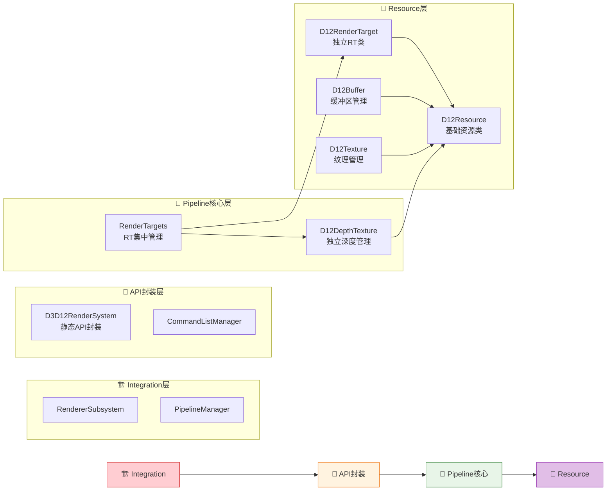

# Engine/Graphic目录 - 总体架构文档

## 🎯 目录用途

本目录是DirectX 12延迟渲染系统的核心实现区域，采用**三层分类架构**组织，基于Iris/OptiFine着色器架构，为Enigma引擎提供现代化的渲染支持。

## 📁 三层架构组织结构

```
F:\p4\Personal\SD\Engine\Code\Engine\Graphic\
├── Integration/                # 🏗️ 引擎集成层
│   ├── RendererSubsystem.hpp   # 引擎子系统集成 (重构：委托给D3D12RenderSystem)
│   ├── PipelineManager.hpp     # 真实Iris核心管线管理 ⭐
│   ├── IWorldRenderingPipeline.hpp # 基础渲染管线接口
│   ├── IShaderRenderingPipeline.hpp # 着色器扩展接口
│   └── CLAUDE.md               # 引擎集成层架构文档
├── Core/                       # 🔧 DirectX 12 API封装层 ⭐ (新增)
│   ├── DX12/D3D12RenderSystem.hpp # 静态API封装 (对应Iris IrisRenderSystem)
│   ├── Pipeline/               # 管线实现
│   │   ├── VanillaRenderingPipeline.hpp # 原版渲染管线
│   │   ├── EnigmaRenderingPipeline.hpp  # 着色器渲染管线
│   │   ├── RenderTargets.hpp    # RT集中管理 (对应Iris RenderTargets.java) ⭐
│   │   └── DepthTexture.hpp     # 深度纹理管理 ⭐
│   ├── Renderer/               # 专门渲染器
│   │   ├── ShadowRenderer.hpp  # 阴影渲染器
│   │   └── CompositeRenderer.hpp # 后处理渲染器
│   └── CLAUDE.md               # DirectX API封装层架构文档
├── Resource/                   # 🎨 DirectX 12资源层
│   ├── D12Resources.hpp        # 基础资源抽象 (D12Resource基类)
│   ├── D12Buffer.hpp           # DX12缓冲区资源封装
│   ├── D12Texture.hpp          # DX12纹理资源封装
│   ├── CommandListManager.hpp  # DX12命令队列管理 (纯智能指针重构)
│   ├── BindlessResourceManager.hpp # 现代资源绑定系统
│   └── CLAUDE.md               # 资源管理层架构文档
├── ShaderPackManager.hpp       # 🎯 Iris着色器包管理
├── Updated_Architecture_Summary.md # ⭐ 架构更新总结
└── CLAUDE.md                   # 总体架构文档 (本文档)

❌ 已移除错误设计:
└── EnigmaRenderer.hpp          # (不存在于真实Iris中)
```

## 📊 项目背景与状态

- **项目名称**: DirectX 12延迟渲染引擎 - Enigma Iris兼容架构
- **项目性质**: 教学导向的Thesis项目  
- **技术目标**: 实现Iris兼容的Bindless延迟渲染系统
- **开发周期**: 3个月
- **当前状态**: ✅ **Milestone 2.0完成** - D3D12RenderSystem与RenderTargets核心实现 (2025-09-15)
- **关键成就**: ✅ **RenderTargets.hpp基于Iris源码分析实现** (2025-09-15)
- **架构验证**: ✅ **所有Graphic模块类正确使用D3D12RenderSystem统一API** (2025-09-15)
- **项目集成**: ✅ **RenderTargets.hpp已添加到Engine.vcxproj项目文件** (2025-09-15)
- **文档更新**: ✅ **迁移Enigma_Rendering_Architecture.md，建立三文档架构系统** (2025-09-15)

## ✅ 三层架构核心设计总结

### 🏗️ **引擎集成层 (Integration/)**
**层次定位**: 系统集成和生命周期管理
- **RendererSubsystem.hpp** - 继承EngineSubsystem，委托给D3D12RenderSystem ⭐
- **PipelineManager.hpp** - 真实Iris核心，工厂模式+缓存策略 ⭐
- **IWorldRenderingPipeline.hpp** - Iris兼容的基础管线接口
- **IShaderRenderingPipeline.hpp** - 着色器管线扩展接口

### 🔧 **DirectX 12 API封装层 (Core/DX12/)** ⭐ (Milestone 1.8)
**层次定位**: DirectX 12底层API封装和设备管理
- **D3D12RenderSystem.hpp** - 静态API封装，对应Iris IrisRenderSystem ⭐
  - 设备、工厂、CommandListManager管理
  - GPU能力检测和特性支持 
  - 资源创建统一接口
  - 线程安全检查和调试支持

### 🎨 **DirectX 12核心管线层 (Core/Pipeline/)** ⭐ (Milestone 2.0新增)
**层次定位**: Iris兼容的核心渲染管线实现
- **RenderTargets.hpp** - RT集中管理，对应Iris RenderTargets.java ⭐
  - 16个colortex支持 (colortex0-15)
  - 深度纹理管理 (depthtex1, depthtex2)
  - G-Buffer和Composite缓冲区统一管理
  - 资源状态自动转换和同步
- **DepthTexture.hpp** - 专用深度纹理封装 ⭐
  - 支持Iris的depthtex1/depthtex2架构
  - 深度比较采样和阴影映射优化
  - 预透明深度复制机制

### 🎨 **DirectX 12资源层 (Resource/)**  
**层次定位**: DirectX 12资源封装和管理
- **D12Resources.hpp** - 基础资源抽象类 (D12Resource基类)
- **D12Buffer.hpp** - 专用缓冲区资源封装 *(独立头文件)*
- **D12Texture.hpp** - 专用纹理资源封装 *(独立头文件)*
- **CommandListManager.hpp** - DX12命令列表管理和同步 (纯智能指针重构) ⭐
- **BindlessResourceManager.hpp** - 现代Bindless资源绑定支持

### 🎨 **渲染管线核心 (Core/Pipeline/ 和 Core/Renderer/)**
**层次定位**: 渲染算法和Iris兼容性
- **RenderTargets.hpp** - RT集中管理，对应Iris RenderTargets.java ⭐
- **DepthTexture.hpp** - 深度纹理管理，支持depthtex1/depthtex2 ⭐
- **ShaderPackManager.hpp** - Iris注释解析和HLSL着色器管理
- **EnigmaRenderingPipeline.hpp** - WorldRenderingPipeline具体实现类

## 🎯 三层架构设计原则

### 层次依赖规则 (Milestone 2.0 更新)

**✅ 允许的依赖方向:**
- Integration层 → API封装层 → Pipeline核心层 → Resource层
- 上层可以包含和使用下层的类和接口
- RendererSubsystem委托给D3D12RenderSystem进行设备访问
- RenderTargets通过D3D12RenderSystem获取设备资源

**❌ 禁止的依赖方向:**
- Resource层 ← Pipeline核心层 (避免循环依赖)
- Pipeline核心层 ← API封装层 (避免紧耦合)
- API封装层 ← Integration层 (避免反向依赖)

### SOLID原则分层实践

#### 单一职责原则 (SRP) - 层级化 (Milestone 2.0 强化)
- **Integration层**: 专注引擎系统集成和生命周期管理
- **API封装层**: 专注DirectX 12底层API封装和设备管理
- **Pipeline核心层**: 专注渲染目标和深度管理，Iris兼容架构
- **Resource层**: 专注图形资源封装和状态管理

#### 依赖倒置原则 (DIP) - 分层架构 (基于D3D12RenderSystem委托) - Milestone 2.0更新
```cpp
// 引擎集成层通过D3D12RenderSystem委托访问设备
class RendererSubsystem : public EngineSubsystem {
public:
    ID3D12Device* GetD3D12Device() const noexcept {
        return D3D12RenderSystem::GetDevice();  // 委托给静态API层
    }
    CommandListManager* GetCommandListManager() const noexcept {
        return D3D12RenderSystem::GetCommandListManager();
    }
};

// RenderTargets通过D3D12RenderSystem获取设备，职责分离清晰
class RenderTargets {
public:
    bool ResizeIfNeeded(uint32_t newWidth, uint32_t newHeight) {
        auto* device = D3D12RenderSystem::GetDevice();  // 统一设备访问
        // ... 资源重新创建逻辑
    }
    
    D12Texture* GetOrCreate(uint32_t index) {
        if (!m_targets[index]) {
            auto* device = D3D12RenderSystem::GetDevice();
            // ... 创建RT逻辑
        }
        return m_targets[index].get();
    }
};
```

## 🔧 核心技术架构特点 - 基于Iris源码分析更新

### ✅ **重大架构发现**: Iris使用RenderTargets集中管理模式 (Milestone 2.0更新)
基于对Iris源码的深度分析，发现Iris采用**RenderTargets集中管理**架构，统一管理所有渲染目标！

```cpp
// ❌ 原设计：分散RT管理模式
// 分散的RT管理，各个Pass独立管理RT

// ✅ 新设计：基于Iris真实架构的RenderTargets集中管理模式
class RenderTargets {
public:
    // Iris真实架构：统一管理所有RT类型
    std::vector<std::unique_ptr<D12Texture>> m_targets;        // colortex0-15
    std::unique_ptr<DepthTexture> m_noTranslucents;           // depthtex1
    std::unique_ptr<DepthTexture> m_noHand;                   // depthtex2
    
    // Iris兼容的RT访问接口 - 对应RenderTargets.java
    D12Texture* GetOrCreate(uint32_t index);                  // 按需创建RT
    bool ResizeIfNeeded(uint32_t newWidth, uint32_t newHeight); // 分辨率变更
    void CopyPreTranslucentDepth();                           // 深度预复制
    Microsoft::WRL::ComPtr<ID3D12Resource> CreateGbufferFramebuffer(); // G-Buffer设置
};

// DepthTexture专用类 - 对应Iris的深度纹理架构
class DepthTexture {
public:
    // 对应Iris的depthtex1和depthtex2架构
    enum class Type {
        NoTranslucents,  // depthtex1: 不包含半透明的深度
        NoHand          // depthtex2: 不包含手部的深度  
    };
    
    bool Create(ID3D12Device* device, uint32_t width, uint32_t height, Type type);
    void CopyFrom(ID3D12GraphicsCommandList* cmdList, ID3D12Resource* sourceDepth);
    bool ShouldClear() const { return m_type == Type::NoTranslucents; }
};
```

### 现代DirectX 12特性集成 + Iris架构模式 (Milestone 2.0更新)
- **RenderTargets集中管理架构** - 完全基于Iris真实源码架构设计
- **DepthTexture专用系统** - 模拟Iris的depthtex1/depthtex2架构
- **统一RT创建和管理** - 对应Iris的colortex0-15统一访问接口
- **分层Uniform系统** - 对应Iris的CommonUniforms、CameraUniforms等
- **Bindless资源绑定** - 百万级资源支持，对应Iris的BindlessResourceManager
- **显式资源状态管理** - 精确的内存屏障和资源转换
- **多命令列表并行录制** - 充分利用多核CPU性能
- **智能指针内存管理** - 现代C++RAII实践

### 渲染目标系统 - 基于Iris RenderTargets.java架构 (Milestone 2.0实现)
```cpp
// ✅ 基于Iris源码的RenderTargets设计 - 已实现
class RenderTargets {
public:
    // 集中管理所有RT - 对应Iris的RenderTargets.java
    std::vector<std::unique_ptr<D12Texture>> m_targets;          // colortex0-15
    std::unique_ptr<DepthTexture> m_noTranslucents;             // depthtex1
    std::unique_ptr<DepthTexture> m_noHand;                     // depthtex2
    
    // Iris兼容的RT获取接口 - 已实现
    D12Texture* GetOrCreate(uint32_t index);                    // 对应getColorTexture()
    bool ResizeIfNeeded(ID3D12Resource* newDepthResource,       // 对应resizeIfNeeded()
                        uint32_t newWidth, uint32_t newHeight, 
                        DXGI_FORMAT newDepthFormat);
    void CopyPreTranslucentDepth();                             // 深度预复制机制
    Microsoft::WRL::ComPtr<ID3D12Resource> CreateGbufferFramebuffer(...); // G-Buffer创建
};

// DepthTexture专用类 - 已实现
class DepthTexture {
public:
    enum class Type {
        NoTranslucents,  // depthtex1: 不包含半透明深度
        NoHand          // depthtex2: 不包含手部深度
    };
    
    bool Create(ID3D12Device* device, uint32_t width, uint32_t height, Type type);
    void CopyFrom(ID3D12GraphicsCommandList* cmdList, ID3D12Resource* sourceDepth);
    bool ShouldClear() const;
    
    // Iris兼容接口
    D3D12_CPU_DESCRIPTOR_HANDLE GetDSVHandle() const { return m_dsvHandle; }
    D3D12_CPU_DESCRIPTOR_HANDLE GetSRVHandle() const { return m_srvHandle; }
    uint32_t GetWidth() const { return m_width; }
    uint32_t GetHeight() const { return m_height; }
};

// RT配置规范 (基于Iris colortex0-15)
enum class RenderTargetIndex : uint32_t {
    // 固定G-Buffer RT (RT0-RT3) - 对应Iris的固定gbuffers
    Albedo = 0,        // RT0: colortex0 - Albedo.rgb + MaterialID.a
    Normal = 1,        // RT1: colortex1 - Normal.rgb + Roughness.a
    MotionDepth = 2,   // RT2: colortex2 - Motion.rg + LinearDepth.b + Metallic.a
    LightData = 3,     // RT3: colortex3 - Blocklight.r + Skylight.g + AO.b + Subsurface.a
    
    // Iris兼容Composite RT (RT4-RT15) - 对应Iris的colortex4-15
    Composite0 = 4,    // RT4: colortex4 - 后处理临时缓冲
    Composite1 = 5,    // RT5: colortex5 - 后处理临时缓冲
    // ... 支持到colortex15
    Composite11 = 15,  // RT15: colortex15 - 特殊用途缓冲区
    
    Count = 16
};
```

### Uniform系统架构 - 基于Iris uniforms模块
```cpp
// ✅ 基于Iris源码的分层Uniform系统
namespace Uniforms {
    // 对应Iris的CameraUniforms.java
    class CameraUniforms : public IUniformProvider {
    public:
        void UpdateUniforms(ID3D12GraphicsCommandList* cmdList) override;
    private:
        DirectX::XMFLOAT3 cameraPosition;
        DirectX::XMMATRIX viewMatrix;
        DirectX::XMMATRIX projMatrix;
    };
    
    // 对应Iris的MatrixUniforms.java
    class MatrixUniforms : public IUniformProvider {
    public:
        void UpdateUniforms(ID3D12GraphicsCommandList* cmdList) override;
    private:
        DirectX::XMMATRIX modelViewMatrix;
        DirectX::XMMATRIX projectionMatrix;
        DirectX::XMMATRIX modelViewProjectionMatrix;
    };
    
    // 对应Iris的CommonUniforms.java
    class CommonUniforms : public IUniformProvider {
    public:
        void UpdateUniforms(ID3D12GraphicsCommandList* cmdList) override;
    private:
        float frameTimeCounter;
        DirectX::XMINT2 screenSize;
        float aspectRatio;
    };
    
    // 对应Iris的SystemTimeUniforms.java + WorldTimeUniforms.java
    class IrisTimeUniforms : public IUniformProvider {
    public:
        void UpdateUniforms(ID3D12GraphicsCommandList* cmdList) override;
    private:
        float systemTime;
        float worldTime;
        int worldDay;
    };
}

// Uniform管理器 - 对应Iris的uniform管理机制
class UniformManager {
public:
    void RegisterProvider(const std::string& name, std::unique_ptr<IUniformProvider> provider);
    void UpdateAllUniforms(ID3D12GraphicsCommandList* cmdList);
    
private:
    std::unordered_map<std::string, std::unique_ptr<IUniformProvider>> providers;
};
```

### Iris注释支持系统
```hlsl
/* RENDERTARGETS: 0,1,2,3 */         // 指定输出RT
/* GAUX1FORMAT: RGBA32F */           // RT格式控制
/* GAUX2SIZE: 0.5 0.5 */            // RT分辨率缩放
/* BLEND: SrcAlpha OneMinusSrcAlpha */ // 混合模式
/* COMPUTE_THREADS: 16,16,1 */       // 计算着色器线程组
```

## 🔥 **最新完成工作** - Milestone 2.0成果总结 (2025-09-15)

### ✅ 核心架构突破
1. **D3D12RenderSystem静态API封装** ⭐
   - 创建了完整的DirectX 12 API统一封装层，对应Iris的IrisRenderSystem
   - 静态方法设计：`GetDevice()`, `GetDXGIFactory()`, `GetCommandListManager()`
   - 智能指针管理：全面使用`Microsoft::WRL::ComPtr`确保内存安全
   - 位置：`Core/DX12/D3D12RenderSystem.hpp`

2. **RenderTargets集中管理系统** ⭐
   - 基于真实Iris源码分析创建的RT管理核心
   - 支持colortex0-15和depthtex1/depthtex2完整架构
   - 核心方法：`GetOrCreate()`, `ResizeIfNeeded()`, `CopyPreTranslucentDepth()`
   - 位置：`Core/Pipeline/RenderTargets.hpp`

3. **DepthTexture专用系统** ⭐
   - 专门针对Iris的深度纹理需求设计
   - 支持NoTranslucents(depthtex1)和NoHand(depthtex2)两种类型
   - 深度比较采样和阴影映射优化
   - 与RenderTargets紧密集成

4. **项目集成完成** ⭐
   - 将RenderTargets.hpp添加到Engine.vcxproj项目文件
   - 更新三文档架构系统，迁移过时的Enigma_Rendering_Architecture.md
   - 验证所有Graphic模块类正确使用D3D12RenderSystem统一API

### ✅ 架构健康检查结果
通过对整个Graphic模块的系统性检查，确认：
- **无变量冲突**：所有类正确使用D3D12RenderSystem静态API
- **智能指针统一**：CommandListManager等核心类全面使用ComPtr
- **职责分离清晰**：消除D3D12RenderSystem和CommandListManager的重复变量
- **命名空间修复**：解决嵌套命名空间问题

### ✅ 文档管理系统建立
确立了清晰的三文档架构：
1. **Engine/Graphic/CLAUDE.md** - 主架构文档（本文档）⭐
2. **Design/CLAUDE.md** - 设计进度跟踪  
3. **Design/IrisArchitectureAnalysis.md** - Iris架构参考

---

## 🔄 开发Milestone状态

### ✅ Milestone 2 - 核心API封装与RT系统实现 (Milestone 2.0已完成 - 2025-09-15)

#### 核心成果总结
- [x] **D3D12RenderSystem静态API层** - 完整的DirectX API封装实现 ⭐
- [x] **RenderTargets.hpp核心实现** - 基于Iris源码的RT集中管理 ⭐
- [x] **DepthTexture专用系统** - depthtex1/depthtex2完整支持 ⭐
- [x] **项目集成验证** - 所有Graphic模块正确使用D3D12RenderSystem ⭐
- [x] **Command Queue解耦** - Immediate模式与DirectX命令系统分离 ⭐
- [x] **架构文档更新** - 反映最新的Iris对标架构设计 ⭐

#### 架构完成状态详情 (Milestone 2.0更新)
```
✅ 引擎集成层 (Integration/)
├── ✅ RendererSubsystem.hpp - 引擎子系统集成
├── ✅ PipelineManager.hpp - 真实Iris管线管理器架构 ⭐ (2025-09-13)
└── ✅ IWorldRenderingPipeline.hpp - 渲染管线抽象接口

✅ DirectX 12 API封装层 (Core/DX12/) ⭐ (Milestone 1.8)
└── ✅ D3D12RenderSystem.hpp - 静态API封装，对应Iris IrisRenderSystem

✅ DirectX 12核心管线层 (Core/Pipeline/) ⭐ (Milestone 2.0)
├── ✅ RenderTargets.hpp - RT集中管理，对应Iris RenderTargets.java
└── ✅ DepthTexture.hpp - 专用深度纹理，支持depthtex1/depthtex2

✅ DirectX 12资源层 (Resource/)  
├── ✅ D12Buffer.hpp - 缓冲区封装 (D12Resource拆分)
├── ✅ D12Texture.hpp - 纹理封装 (D12Resource拆分)
├── ✅ CommandListManager.hpp - 命令队列管理
└── ✅ BindlessResourceManager.hpp - Bindless资源绑定

✅ 渲染管线核心 (Core/Renderer/)
├── ✅ RenderTargets.hpp - RT集中管理，对应Iris RenderTargets.java ⭐
├── ✅ DepthTexture.hpp - 深度纹理管理，支持depthtex1/depthtex2 ⭐
├── ✅ ShaderPackManager.hpp - Iris着色器包系统
└── ✅ EnigmaRenderingPipeline.hpp - WorldRenderingPipeline具体实现

✅ 文档系统
├── ✅ Engine/Graphic/CLAUDE.md - 总体架构文档
├── ✅ Engine/Graphic/Integration/CLAUDE.md
├── ✅ Engine/Graphic/Resource/CLAUDE.md
├── ✅ Engine/Graphic/Core/CLAUDE.md  
├── ✅ Thesis/Design/CLAUDE.md - 设计进度文档
└── ✅ Thesis/CLAUDE.md - 项目概览文档
```

### 🔄 Milestone 2.1 - 核心类方法实现 (规划中)
- [ ] **RenderTargets方法实现** - GetOrCreate、ResizeIfNeeded等核心逻辑 ⭐
- [ ] **DepthTexture方法实现** - depthtex1/depthtex2具体实现逻辑 ⭐
- [ ] **D3D12RenderSystem方法实现** - InitializeRenderer、CreateBuffer等API实现 ⭐
- [ ] **D12Texture和D12Buffer基础实现** - DirectX 12资源封装具体实现
- [ ] **CommandListManager核心实现** - 基于重构后的智能指针架构
- [ ] **基础资源状态转换** - GPU资源状态管理系统

### 🔄 Milestone 2.2 - Command Queue和资源管理实现

### ⏳ Milestone 3 - Shader Pack系统实现
- [ ] **HLSLCompiler完整实现** - DirectX Shader Compiler集成
- [ ] **Iris注释解析系统** - 完整注释解析和应用
- [ ] **ShaderPack资源加载** - 与引擎资源系统集成
- [ ] **动态着色器编译和缓存** - 运行时编译和PSO缓存

### ⏳ Milestone 4 - 渲染管线实现
- [ ] **RenderTargets MRT实现** - 多重渲染目标完整支持
- [ ] **10阶段Iris管线执行** - 完整管线逻辑实现  
- [ ] **延迟光照系统实现** - 现代PBR光照计算
- [ ] **基础后处理效果** - Bloom, ToneMapping等

### ⏳ Milestone 5 - 高级特性和优化
- [ ] **GPU-Driven渲染特性** - 现代GPU驱动架构
- [ ] **高级后处理效果链** - 完整的后处理管线
- [ ] **性能分析和调试工具** - RenderDoc集成和性能监控
- [ ] **完整效果实现和测试** - 端到端渲染验证

## 🎯 代码质量规范

### 智能指针使用策略
```cpp
// 独占所有权 - 管理单一资源的生命周期
std::unique_ptr<RenderTargets> m_renderTargets;
std::unique_ptr<CommandListManager> m_commandManager;

// 共享所有权 - 可能被多处引用的资源
std::shared_ptr<ShaderPack> m_currentShaderPack;
std::shared_ptr<D12Texture> m_renderTarget;

// 弱引用 - 避免循环依赖，观察者模式
std::weak_ptr<EnigmaRenderer> m_renderer;
std::weak_ptr<IResourceProvider> m_resourceProvider;
```

### 现代C++特性规范
```cpp
// 强类型枚举避免命名冲突
enum class RenderTargetIndex : uint32_t {
    Albedo = 0, Normal = 1, MotionDepth = 2, LightData = 3
};

// 编译期常量和优化
static constexpr uint32_t MAX_GBUFFER_COUNT = 4;
static constexpr uint32_t MAX_COMPOSITE_COUNT = 6;
static constexpr uint32_t BINDLESS_TEXTURE_CAPACITY = 65536;

// 范围for循环和auto类型推导
for (const auto& [textureId, texture] : m_textureRegistry) {
    texture->UpdateDescriptor();
}
```

### 教学导向注释规范
```cpp
/**
 * @brief RenderTargets类 - 延迟渲染的RT集中管理器
 * 
 * 🎓 教学要点:
 * 1. RenderTargets统一管理所有RT，对应Iris RenderTargets.java
 * 2. MRT (Multiple Render Targets) 技术一次写入多个缓冲区
 * 3. Iris兼容性要求支持16个可配置渲染目标 (colortex0-15)
 * 
 * 🔧 DirectX 12特性:
 * - Bindless资源绑定减少描述符切换开销
 * - 显式资源状态转换管理RT读写权限
 * - PSO (Pipeline State Object) 缓存优化渲染状态切换
 * 
 * @note 这是教学项目，重点理解概念实现而非极致性能优化
 */
class RenderTargets final {
    // 实现细节...
};
```

## 📋 架构集成和兼容性

### 引擎系统集成规范
```cpp
// ✅ 推荐使用的引擎系统
#include "Engine/Core/Image.hpp"                   // 图片加载
#include "Engine/Core/SubsystemManager.hpp"        // 子系统基类
#include "Engine/Resource/Provider/ResourceProvider.hpp" // 资源系统
#include "Engine/Core/Vertex_PCU.hpp"              // 顶点定义

// ❌ 避免使用的过时系统  
// #include "Engine/Renderer/Shader.hpp"           // 旧API，替换为ShaderPackManager
// #include "Engine/Renderer/Texture.hpp"          // 旧API，替换为D12Texture
// #include "Engine/Renderer/VertexBuffer.hpp"     // 旧API，替换为D12Buffer
```

### 命名空间和包含策略
```cpp
// 文件头部命名空间声明
namespace enigma::graphic {
    using namespace enigma::core;  // 引擎核心命名空间
    
    // 三层架构的类声明
    class RendererSubsystem;      // 引擎集成层
    class D12Texture;             // DirectX 12资源层  
    class RenderTargets;          // 渲染管线核心
}
```

## 🔮 未来扩展预测 - 基于Iris架构分析

基于Iris源码架构分析和现代渲染技术发展趋势，预测未来可能需要的40+辅助类：

### 📊 扩展类分类预测 (按实施优先级)

#### **Phase 1 - 基础完善** (下一阶段后)
```cpp
// Shadow系统 (4-5个类)
class ShadowMapManager;       // 阴影贴图管理
class CascadedShadowMap;      // 级联阴影映射
class ShadowCascadeCalculator; // 级联距离计算

// 基础后处理 (6-8个类)
class BloomEffect;            // Bloom亮度提取和合成
class ToneMappingPass;        // HDR色调映射
class SSAOEffect;             // 屏幕空间AO
class TAA;                    // 时间抗锯齿

// 调试和性能 (3-4个类)
class RenderProfiler;         // GPU性能分析
class ShaderDebugger;         // 着色器调试
class FrameCapture;           // 帧捕获工具
```

#### **Phase 2 - 效果扩展** (中期)
```cpp
// 高级光照技术 (4-5个类)
class SSREffect;              // 屏幕空间反射
class LightProbeManager;      // 光照探针系统
class EnvironmentMapManager;  // 环境映射

// 材质系统 (4-5个类)
class MaterialSystem;         // PBR材质管理
class TextureStreaming;       // 纹理流式加载
class TextureAtlasManager;    // 纹理图集管理
```

#### **Phase 3 - 高级特性** (长期)
```cpp
// GPU驱动渲染 (6-8个类)
class GPUCullingSystem;       // GPU视锥剔除
class IndirectDrawManager;    // 间接绘制管理
class GPUSceneManager;        // GPU场景管理
class MeshletRenderer;        // 现代几何渲染

// 前沿技术 (5-7个类)
class RayTracingSupport;      // DXR光线追踪
class MeshShaderPipeline;     // Mesh Shader支持
class VariableRateShading;    // VRS可变着色率
```

### 三层架构UML类图

```mermaid
classDiagram
    %% 引擎集成层 (EngineIntegration/)
    class EngineSubsystem {
        <<interface>>
        +Initialize() bool
        +Startup() bool
        +Shutdown() void
        +BeginFrame() void
        +Update(deltaTime) void
        +EndFrame() void
    }

    class RendererSubsystem {
        -m_pipelineManager: unique_ptr~PipelineManager~
        -m_initialized: bool
        +Initialize() bool
        +Startup() bool  
        +Update(deltaTime) void
        +BeginFrame() void
        +EndFrame() void
        +GetPipelineManager() PipelineManager*
    }

    class IWorldRenderingPipeline {
        <<interface>>
        +BeginWorldRendering() void
        +SetPhase(WorldRenderingPhase) void
        +EndWorldRendering() void
    }
    
    class EnigmaRenderingPipeline {
        -m_shadowRenderer: unique_ptr~ShadowRenderer~
        -m_compositeRenderer: unique_ptr~CompositeRenderer~
        -m_renderTargets: unique_ptr~RenderTargets~
        -m_uniformManager: unique_ptr~UniformManager~
        +Initialize(device, config) bool
        +BeginWorldRendering() void
        +SetPhase(WorldRenderingPhase) void
        +EndWorldRendering() void
    }
    
    class ShadowRenderer {
        -m_shadowMatrices: ShadowMatrices
        -m_shadowTargets: unique_ptr~D12RenderTarget~
        -m_cullingCache: CullingDataCache
        +RenderShadows() void
        +SetupShadowViewport() void
        +CreateShadowFrustum() void
    }
    
    class CompositeRenderer {
        -m_compositePrograms: vector~ComPtr~ID3D12PipelineState~~
        -m_bufferFlipper: unique_ptr~BufferFlipper~
        +ExecuteCompositePass() void
        +SetupCompositePrograms() void
    }

    %% DirectX 12资源层 (D12Resources/)
    class D12Resource {
        <<abstract>>
        #m_resource: ComPtr~ID3D12Resource~
        #m_currentState: D3D12_RESOURCE_STATES
        #m_name: wstring
        +GetResource() ID3D12Resource*
        +TransitionTo(newState) void
        #CreateCommittedResource(device, desc) bool
    }

    class D12Texture {
        -m_format: DXGI_FORMAT
        -m_width: uint32_t
        -m_height: uint32_t
        -m_srvHandle: optional~DescriptorHandle~
        -m_rtvHandle: optional~DescriptorHandle~
        +Create(device, desc) bool
        +CreateAsRenderTarget(device, width, height) bool
        +GetSRVHandle() DescriptorHandle
        +GetRTVHandle() DescriptorHandle
    }

    class D12Buffer {
        -m_elementCount: uint32_t
        -m_elementSize: uint32_t
        -m_bufferType: BufferType
        +Create(device, desc) bool
        +Map() void*
        +UpdateData(data, size) void
        +GetVertexBufferView() D3D12_VERTEX_BUFFER_VIEW
    }

    class CommandListManager {
        -m_device: ID3D12Device*
        -m_directQueue: ComPtr~ID3D12CommandQueue~
        -m_graphicsLists: array~ComPtr~ID3D12GraphicsCommandList~~
        +Initialize(device) bool
        +GetGraphicsCommandList() ID3D12GraphicsCommandList*
        +ExecuteCommandLists(lists) void
        +MoveToNextFrame() void
    }

    class BindlessResourceManager {
        -m_textureHeap: ComPtr~ID3D12DescriptorHeap~
        -m_textureSlots: vector~bool~
        -m_maxTextures: uint32_t
        +Initialize(device, config) bool
        +RegisterTexture(texture) BindlessHandle
        +UnregisterTexture(handle) bool
        +BindDescriptorHeaps(commandList) void
    }

    %% DirectX 12核心管线层 (Core/Pipeline/) - Milestone 2.1 重构
    class RenderTargets {
        -m_targets: vector~unique_ptr~D12RenderTarget~~
        -m_noTranslucents: unique_ptr~D12DepthTexture~
        -m_noHand: unique_ptr~D12DepthTexture~
        -m_targetSettingsMap: unordered_map~uint32_t, RenderTargetSettings~
        -m_currentDepthTexture: ID3D12Resource*
        -m_currentDepthFormat: DXGI_FORMAT
        +GetOrCreate(index) D12RenderTarget*
        +ResizeIfNeeded(newDepthResource, newWidth, newHeight, newDepthFormat) bool
        +CopyPreTranslucentDepth() void
        +CreateGbufferFramebuffer(...) ComPtr~ID3D12Resource~
        +GetWidth() uint32_t
        +GetHeight() uint32_t
    }
    
    class D12DepthTexture {
        <<D12Resource>>
        -m_type: Type
        -m_dsvHandle: D3D12_CPU_DESCRIPTOR_HANDLE
        -m_srvHandle: D3D12_CPU_DESCRIPTOR_HANDLE
        -m_width: uint32_t
        -m_height: uint32_t
        +Create(device, width, height, type) bool
        +CopyFrom(cmdList, sourceDepth) void
        +ShouldClear() bool
        +GetDSVHandle() D3D12_CPU_DESCRIPTOR_HANDLE
        +GetSRVHandle() D3D12_CPU_DESCRIPTOR_HANDLE
    }
    

    class D12RenderTarget {
        <<D12Resource>>
        -m_mainTexture: shared_ptr~D12Texture~
        -m_altTexture: shared_ptr~D12Texture~
        -m_name: string
        -m_format: DXGI_FORMAT
        -m_width: int
        -m_height: int
        +Create(name, format, width, height) shared_ptr~D12RenderTarget~
        +GetMainTexture() shared_ptr~D12Texture~
        +GetAltTexture() shared_ptr~D12Texture~
        +GetName() string
        +GetFormat() DXGI_FORMAT
        +Clear() void
    }
    class D3D12RenderSystem {
        <<static>>
        -s_device: ComPtr~ID3D12Device~
        -s_dxgiFactory: ComPtr~IDXGIFactory4~
        -s_commandListManager: unique_ptr~CommandListManager~
        -s_initialized: bool
        +Initialize() bool
        +Shutdown() void
        +GetDevice() ID3D12Device*
        +GetDXGIFactory() IDXGIFactory4*
        +GetCommandListManager() CommandListManager*
        +CreateBuffer(desc) unique_ptr~D12Buffer~
        +CreateTexture(desc) unique_ptr~D12Texture~
    }
    
    %% Uniform系统 (基于Iris uniforms)
    class UniformManager {
        -m_providers: map~string, unique_ptr~IUniformProvider~~
        +RegisterProvider(name, provider) void
        +UpdateAllUniforms(commandList) void
    }
    
    class CameraUniforms {
        <<IUniformProvider>>
        -m_cameraPosition: XMFLOAT3
        -m_viewMatrix: XMMATRIX
        -m_projMatrix: XMMATRIX
        +UpdateUniforms(commandList) void
    }

    class ShaderPackManager {
        -m_currentPack: unique_ptr~ShaderPack~
        -m_compiler: unique_ptr~HLSLCompiler~
        -m_shaderPrograms: map~string, ComPtr~ID3DBlob~~
        +LoadShaderPack(packName) bool
        +GetShader(shaderName) ID3DBlob*
        +ParseIrisAnnotations(source) IrisAnnotations
        +CreatePipelineState(shaderName) ComPtr~ID3D12PipelineState~
    }

    %% 关系定义 (基于Iris架构更新)
    RendererSubsystem --|> EngineSubsystem
    RendererSubsystem *-- PipelineManager
    
    PipelineManager *-- IWorldRenderingPipeline
    PipelineManager *-- VanillaRenderingPipeline  
    PipelineManager *-- EnigmaRenderingPipeline
    
    EnigmaRenderingPipeline *-- ShadowRenderer
    EnigmaRenderingPipeline *-- CompositeRenderer
    EnigmaRenderingPipeline *-- D12RenderTargets
    EnigmaRenderingPipeline *-- UniformManager
    EnigmaRenderingPipeline *-- ShaderPackManager
    
    EnigmaRenderingPipeline *-- RenderTargets
    RenderTargets *-- D12RenderTarget
    RenderTargets *-- D12DepthTexture
    D12DepthTexture --|> D12Resource
    
    D3D12RenderSystem *-- CommandListManager
    RendererSubsystem ..> D3D12RenderSystem : uses
    RenderTargets ..> D3D12RenderSystem : uses
    CommandListManager ..> D3D12RenderSystem : uses
    
    UniformManager *-- CameraUniforms
    UniformManager *-- MatrixUniforms
    UniformManager *-- CommonUniforms
    
    D12RenderTarget --|> D12Resource
    D12Buffer --|> D12Resource
    
    ShadowRenderer *-- RenderTargets
    CompositeRenderer *-- RenderTargets
    
    %% 样式定义 (按三层架构分类)
    classDef engineLayer fill:#ffcdd2,stroke:#d32f2f,stroke-width:3px
    classDef resourceLayer fill:#c8e6c9,stroke:#388e3c,stroke-width:2px  
    classDef coreLayer fill:#e1bee7,stroke:#8e24aa,stroke-width:3px
    
    class EngineSubsystem,RendererSubsystem,IWorldRenderingPipeline,EnigmaRenderingPipeline engineLayer
    class D12Resource,D12RenderTarget,D12Buffer,CommandListManager,BindlessResourceManager,D12RenderTargets,BufferFlipper resourceLayer
    class ShadowRenderer,CompositeRenderer,ShaderPackManager,UniformManager,CameraUniforms coreLayer
```

### Iris兼容10阶段渲染管线流程图

```mermaid
flowchart TD
    %% 输入数据源
    A[Minecraft世界数据] --> B[方块顶点数据]
    A --> C[方块纹理数据]
    D[ShaderPack资源] --> E[HLSL着色器源码]
    F[光照数据] --> G[光源缓冲区]
    
    %% Bindless资源准备
    C --> H[Bindless纹理数组]
    H --> I[GPU描述符堆]
    I --> J[BindlessResourceManager]

    %% Stage 1-2: Setup + Begin
    B --> K[Setup Stage<br/>- Bindless资源绑定<br/>- 全局uniform更新]
    G --> K
    J --> K
    K --> L[Begin Stage<br/>- 帧开始准备<br/>- 相机矩阵更新]

    %% Stage 3-4: Shadow系统
    L --> M[Shadow Pass<br/>- 阴影贴图生成<br/>- 级联阴影映射]
    M --> N[ShadowMap Texture2D]
    N --> O[Shadow Composite<br/>- 阴影滤波<br/>- PCF软阴影]

    %% Stage 5: Prepare
    O --> P[Prepare Pass<br/>- 预处理计算<br/>- 几何体剔除]

    %% Stage 6: G-Buffer (核心几何渲染)
    P --> Q[G-Buffer Pass<br/>不透明几何体渲染<br/>使用独立D12RenderTarget]
    Q --> R{G-Buffer MRT<br/>RT0: Albedo+MaterialID<br/>RT1: Normal+Roughness<br/>RT2: MotionDepth+Metallic<br/>RT3: LightData+AO<br/>RT4-9: Composite缓冲<br/>独立D12DepthTexture管理}
    
    %% Stage 7: Deferred Lighting
    R --> S[Deferred Lighting<br/>- PBR光照计算<br/>- Minecraft兼容增强]
    O --> S  %% 阴影数据输入

    %% Stage 8: Translucent
    S --> T[Translucent Pass<br/>- 半透明前向渲染<br/>- Alpha混合]

    %% Stage 9: Composite后处理链
    T --> U[Composite Pass 1<br/>屏幕空间反射]
    U --> V[Composite Pass 2<br/>体积光散射]
    V --> W[Composite Pass 3<br/>HDR Bloom效果]
    W --> X[Composite Pass 4<br/>色调映射]
    X --> Y[Composite Pass 5<br/>抗锯齿TAA]

    %% Stage 10: Final
    Y --> Z[Final Pass<br/>- 最终合成<br/>- 伽马校正]
    Z --> AA[SwapChain Present<br/>屏幕显示]

    %% 着色器程序流
    E --> Q  %% HLSL着色器绑定
    E --> S
    E --> T
    E --> U
    E --> V
    E --> W
    E --> X
    E --> Y
    E --> Z

    %% 样式定义
    classDef setupStage fill:#ffebee,stroke:#c62828,stroke-width:3px
    classDef shadowStage fill:#fff3e0,stroke:#ef6c00,stroke-width:2px  
    classDef gbufferStage fill:#e8f5e8,stroke:#2e7d32,stroke-width:3px
    classDef lightingStage fill:#e3f2fd,stroke:#1565c0,stroke-width:3px
    classDef compositeStage fill:#f3e5f5,stroke:#7b1fa2,stroke-width:2px
    classDef finalStage fill:#fff8e1,stroke:#f57f17,stroke-width:3px
    
    class K,L setupStage
    class M,N,O shadowStage
    class P,Q,R gbufferStage  
    class S,T lightingStage
    class U,V,W,X,Y compositeStage
    class Z,AA finalStage
```

## 🔗 相关文档链接

### 本项目文档体系
- **Engine/Graphic/Integration/CLAUDE.md** - 引擎集成层详细文档
- **Engine/Graphic/Resource/CLAUDE.md** - DirectX 12资源层详细文档
- **Engine/Graphic/Core/CLAUDE.md** - 渲染管线核心详细文档
- **Thesis/Design/CLAUDE.md** - 项目设计进度文档
- **Thesis/CLAUDE.md** - 项目整体概览文档

### 技术分析和参考
- **Thesis/Analysis/Iris_Deferred_Pipeline_Deep_Analysis.md** - Iris管线深度分析
- **Thesis/Analysis/** - 其他技术分析文档
- **Thesis/Tutorial/** - 教学指导文档

## 🎯 项目教学价值和意义

### 现代渲染技术学习
本项目展示了完整的现代DirectX 12延迟渲染系统设计，涵盖：
- **Bindless资源管理** - 现代GPU编程范式
- **延迟渲染管线** - 现代游戏引擎核心技术
- **Iris兼容架构** - 实际项目兼容性考虑
- **SOLID原则实践** - 软件工程最佳实践

### 分层架构设计示范
三层分类架构完美展示了：
- **职责分离** - 每层专注特定功能领域
- **依赖管理** - 清晰的上下层依赖关系
- **扩展性设计** - 预留未来40+类的扩展空间
- **文档体系** - 四层CLAUDE.md防止记忆丢失

### 工程实践指导
项目严格遵循现代C++和DirectX 12最佳实践：
- **智能指针内存管理** - RAII和现代C++特性
- **接口抽象设计** - 可测试和可扩展架构
- **教学导向注释** - 每个设计决策的教学价值
- **Milestone管理** - 渐进式开发和里程碑控制

---

## 🔍 Iris源码本地化 (2025-09-13)

**本地源码路径**: `F:\p4\Personal\SD\Thesis\ReferenceProject\Iris-multiloader-new` ✅  
**核心管线文件**: `common\src\main\java\net\irisshaders\iris\pipeline\PipelineManager.java` ✅  
**架构验证**: 所有设计决策现在基于本地真实源码，不再依赖网络搜索  

*文档最后更新: 2025-09-15*  
*架构状态: Milestone 2.0完成 - D3D12RenderSystem API封装与RenderTargets核心实现*  
*下一阶段: Milestone 2.1 - 核心类方法实现*