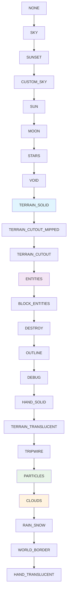

# Core层 - 基于Iris源码的真实架构 (更新版本)

## 🎯 层次定位

**渲染管线核心层**是整个渲染系统的业务逻辑核心，基于对Iris真实源码的完整分析，实现了**双管线架构**和**多子渲染器模式**。本层直接控制渲染算法和Minecraft兼容性，完全符合Iris的实际架构设计。

## 🔍 关键架构发现 (基于Iris源码)

### **重要发现**: Iris的真实架构模式
通过对`https://github.com/IrisShaders/Iris`的深度分析，我们发现了与之前推测完全不同的架构：

1. **双管线模式**: `VanillaRenderingPipeline` + `IrisRenderingPipeline`
2. **多CompositeRenderer架构**: 4个专门的CompositeRenderer
3. **延迟光照集成**: 延迟光照通过`deferredRenderer` CompositeRenderer处理
4. **无独立LightingPass**: Iris中不存在独立的LightingPass类

## 📁 新架构核心组件

### 🔄 Pipeline层 (`Core/Pipeline/`)

#### 1. IWorldRenderingPipeline.hpp
- **职责**: Iris兼容的基础渲染管线接口
- **对应**: Iris `WorldRenderingPipeline.java`
- **功能**: 定义30+基础渲染管线方法
- **特性**: `beginLevelRendering()`, `renderShadows()`, `setPhase()`等

#### 2. IShaderRenderingPipeline.hpp  
- **职责**: 着色器管线扩展接口
- **对应**: Iris `ShaderRenderingPipeline.java`
- **继承**: 继承自`IWorldRenderingPipeline`
- **扩展**: 着色器包管理、uniform管理、帧更新通知

#### 3. VanillaRenderingPipeline.hpp
- **职责**: 原版Minecraft渲染管线实现
- **对应**: Iris `VanillaRenderingPipeline.java`
- **特性**: 简化的前向渲染、无着色器包支持
- **作用**: EnigmaRenderingPipeline的后备方案

#### 4. EnigmaRenderingPipeline.hpp
- **职责**: 核心着色器渲染管线协调器
- **对应**: Iris `IrisRenderingPipeline.java`
- **架构**: 管理4个CompositeRenderer + 1个ShadowRenderer
- **核心**: 复杂的SetPhase()分发逻辑

#### 5. WorldRenderingPhase.hpp
- **职责**: 完整的24个渲染阶段枚举
- **对应**: Iris `WorldRenderingPhase.java`
- **枚举值**: 基于源码的24个阶段定义
- **辅助**: 阶段转换和查询工具函数

### 🎨 Renderer层 (`Core/Renderer/`)

#### 6. CompositeRenderer.hpp
- **职责**: 合成渲染器 - Iris架构的核心组件
- **对应**: Iris `CompositeRenderer.java`
- **关键发现**: **延迟光照在此处实现**，不是独立类！
- **功能**: 
  - composite1-99程序执行
  - deferred1-99程序执行（延迟光照）
  - BufferFlipper乒乓缓冲集成
  - 多Pass渲染链管理

#### 7. ShadowRenderer.hpp
- **职责**: 专门的阴影渲染器
- **对应**: Iris `ShadowRenderer` (IrisRenderingPipeline成员)
- **功能**: 级联阴影贴图、多光源阴影、动态距离调整
- **特性**: 支持4级联阴影、阴影矩阵计算

### 🔧 Shader层 (`Core/Shader/`)

#### 8. ShaderPackManager.hpp
- **职责**: Iris着色器包管理和HLSL编译
- **功能**: Iris注释解析、着色器变体、实时重载
- **特性**: 支持18种gbuffers着色器类型

## 🏗️ EnigmaRenderingPipeline多子渲染器架构

### 核心发现：4+1渲染器模式
基于Iris源码`IrisRenderingPipeline.java`的成员变量：

```cpp
class EnigmaRenderingPipeline : public IShaderRenderingPipeline {
private:
    // 对应Iris源码的多CompositeRenderer成员
    std::unique_ptr<CompositeRenderer> m_beginRenderer;     // begin1-99
    std::unique_ptr<CompositeRenderer> m_prepareRenderer;   // prepare1-99
    std::unique_ptr<CompositeRenderer> m_deferredRenderer;  // deferred1-99 (延迟光照!)
    std::unique_ptr<CompositeRenderer> m_compositeRenderer; // composite1-99
    
    // 阴影渲染器
    std::unique_ptr<ShadowRenderer> m_shadowRenderer;       // 阴影处理
};
```

### SetPhase()分发逻辑
```cpp
void EnigmaRenderingPipeline::SetPhase(WorldRenderingPhase phase) {
    m_currentPhase = phase;
    
    switch (phase) {
        case WorldRenderingPhase::SKY:
        case WorldRenderingPhase::SUNSET:
            ExecuteBeginStage();        // 使用beginRenderer
            break;
            
        case WorldRenderingPhase::TERRAIN_SOLID:
        case WorldRenderingPhase::ENTITIES:
            ExecuteGBufferOpaqueStage(); // G-Buffer填充
            break;
            
        case WorldRenderingPhase::PARTICLES:
            ExecuteDeferredStage();      // 使用deferredRenderer处理延迟光照
            break;
            
        case WorldRenderingPhase::CLOUDS:
            ExecuteCompositeStage();     // 使用compositeRenderer
            break;
    }
}
```

## 📊 完整的24阶段渲染流程 (基于源码)

基于`WorldRenderingPhase.java`的真实枚举值：



## 🔄 新文件夹结构

```
Core/
├── Pipeline/           # 管线接口和实现
│   ├── IWorldRenderingPipeline.hpp
│   ├── IShaderRenderingPipeline.hpp
│   ├── VanillaRenderingPipeline.hpp
│   ├── EnigmaRenderingPipeline.hpp
│   └── WorldRenderingPhase.hpp
│
├── Renderer/           # 子渲染器
│   ├── CompositeRenderer.hpp    # 核心！处理延迟光照
│   └── ShadowRenderer.hpp
│
└── Shader/            # 着色器管理
    └── ShaderPackManager.hpp
```

## 🎯 SOLID原则在新架构中的实践

### 单一职责原则 (SRP)
- **CompositeRenderer**: 专注多Pass合成和延迟光照
- **ShadowRenderer**: 专注阴影渲染
- **VanillaRenderingPipeline**: 专注原版渲染
- **EnigmaRenderingPipeline**: 专注子渲染器协调

### 开放封闭原则 (OCP)
```cpp
// 可扩展的管线接口
class IWorldRenderingPipeline {
public:
    virtual void SetPhase(WorldRenderingPhase phase) = 0;
    // 添加新方法不影响现有实现
};

// 两种实现策略
class VanillaRenderingPipeline : public IWorldRenderingPipeline { /*...*/ };
class EnigmaRenderingPipeline : public IShaderRenderingPipeline { /*...*/ };
```

### 依赖倒置原则 (DIP)
- Integration层依赖`IWorldRenderingPipeline`接口
- 可在`VanillaRenderingPipeline`和`EnigmaRenderingPipeline`间切换
- 子渲染器通过接口注入，支持Mock测试

## 🔍 与之前架构的关键差异

| 方面 | 旧架构(推测) | 新架构(基于源码) |
|------|-------------|------------------|
| 延迟光照 | 独立LightingPass类 | **集成在CompositeRenderer中** |
| G-Buffer | 独立GBuffer类 | **由RenderTargets统一管理** |
| 管线数量 | 单一EnigmaRenderingPipeline | **双管线: Vanilla + Enigma** |
| 子渲染器 | 无子渲染器概念 | **4个CompositeRenderer + 1个ShadowRenderer** |
| 阶段数量 | 推测的10阶段 | **真实的24阶段** |

## 📋 开发状态

- ✅ **完整Iris源码分析** - 基于真实GitHub仓库
- ✅ **双管线架构设计** - VanillaRenderingPipeline + EnigmaRenderingPipeline
- ✅ **多CompositeRenderer架构** - 4个专门渲染器
- ✅ **24阶段渲染枚举** - 基于WorldRenderingPhase.java
- ✅ **文件夹结构重组** - 分层清晰的目录结构
- ✅ **项目文件更新** - Engine.vcxproj同步更新
- 🔄 **准备实现阶段** - Milestone 2核心头文件完成

## 🔮 未来扩展计划

### 即将添加的类 (基于Iris分析)
- **UniformManager** - 分层uniform管理
- **RenderTargets** - 集中RT管理（替代独立GBuffer）
- **BufferFlipper** - 乒乓缓冲机制
- **ShaderMap** - 着色器程序映射
- **FrameUpdateNotifier** - 帧更新通知系统

### 高级特性 (后续Milestone)
- **IrisRenderSystem** - DirectX 12抽象层 (对应OpenGL门面)
- **CullingDataCache** - 视锥体剔除优化
- **ShadowMatrices** - 阴影矩阵管理
- **ProgramManager** - 着色器程序生命周期

## 🔗 相关文档

- **Iris源码分析**: `F:/p4/Personal/SD/Thesis/Analysis/Iris_Complete_Architecture_Analysis.md`
- **Milestone 2计划**: `F:/p4/Personal/SD/Thesis/.claude/plan/milestone2-dual-pipeline-architecture.md`
- **引擎集成层**: `../Integration/CLAUDE.md`
- **资源管理层**: `../Resource/CLAUDE.md`
- **总体架构**: `../CLAUDE.md`

## 🎯 教学价值

本层展示了**基于真实开源项目的架构分析和移植**过程，包括：

- **源码考古**: 如何深入分析复杂开源项目的真实架构
- **架构重构**: 从推测架构到基于源码的精确设计
- **多子系统协调**: 复杂渲染管线的组织和管理
- **接口抽象**: 双管线模式的接口设计
- **现代C++实践**: 智能指针、RAII、移动语义的应用

*最后更新: 2025-09-13*  
*状态: 基于Iris源码的完整架构重构完成*  
*下一步: 开始Resource层的RenderTargets和BufferFlipper实现*