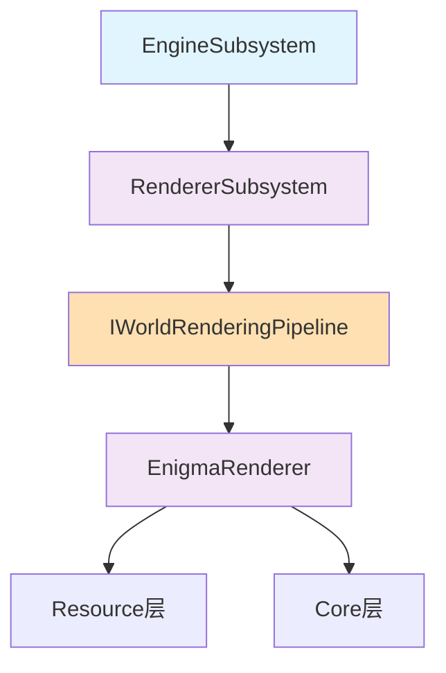

# Integration层 - 引擎集成架构

## 🎯 层次定位

**引擎集成层**是整个渲染系统的最高层，负责将DirectX 12延迟渲染系统与Enigma引擎框架进行无缝集成。本层遵循EngineSubsystem生命周期，确保与引擎其他子系统的协调运行。

## 📁 核心类概览

### 1. RendererSubsystem.hpp
- **职责**: 继承`EngineSubsystem`的主渲染子系统
- **功能**: Iris生命周期映射到引擎生命周期
- **管理**: 持有`EnigmaRenderer`智能指针

### 2. EnigmaRenderer.hpp  
- **职责**: 核心渲染引擎协调器
- **功能**: 执行完整的Iris 10阶段渲染管线
- **架构**: 协调下层资源管理和渲染管线
- **设计模式**: 实现IWorldRenderingPipeline接口，采用immediate模式渲染

### 3. IWorldRenderingPipeline接口 (新增 - Milestone 2)
- **职责**: Iris兼容的渲染管线抽象接口
- **功能**: 定义SetPhase()、BeginWorldRendering()等核心方法
- **设计**: 与Iris的WorldRenderingPipeline完全兼容
- **实现**: EnigmaRenderer作为具体实现类

## 🔄 WorldRenderingPipeline架构设计

### 接口定义
```cpp
// IWorldRenderingPipeline - Iris兼容的渲染管线接口
class IWorldRenderingPipeline {
public:
    virtual ~IWorldRenderingPipeline() = default;
    
    // 核心阶段管理 - 与Iris保持一致
    virtual void SetPhase(WorldRenderingPhase phase) = 0;
    virtual void BeginWorldRendering() = 0;
    virtual void EndWorldRendering() = 0;
    virtual void BeginPass(RenderPass pass) = 0;
    virtual void EndPass(RenderPass pass) = 0;
};

// WorldRenderingPhase枚举 - 对应Iris的10阶段
enum class WorldRenderingPhase : uint32_t {
    None = 0,
    Setup,           // setup1-99
    Begin,           // begin1-99
    Shadow,          // shadow
    ShadowComp,      // shadowcomp1-99
    Prepare,         // prepare1-99
    GBufferOpaque,   // gbuffers_*
    Deferred,        // deferred1-99
    GBufferTrans,    // gbuffers_*_translucent
    Composite,       // composite1-99
    Final            // final
};
```

### EnigmaRenderer实现
```cpp
// EnigmaRenderer - IWorldRenderingPipeline的具体实现
class EnigmaRenderer : public IWorldRenderingPipeline {
private:
    WorldRenderingPhase m_currentPhase = WorldRenderingPhase::None;
    
public:
    void SetPhase(WorldRenderingPhase phase) override {
        m_currentPhase = phase;
        
        // 调用对应的Execute方法 - immediate模式
        switch (phase) {
            case WorldRenderingPhase::Setup:
                ExecuteSetupStage();
                break;
            case WorldRenderingPhase::GBufferOpaque:
                ExecuteGBuffersOpaque();
                break;
            case WorldRenderingPhase::Deferred:
                ExecuteDeferredStage();
                break;
            // ... 其他阶段
        }
    }
    
private:
    // 具体的Execute方法实现 - 对应Iris架构
    void ExecuteSetupStage();
    void ExecuteBeginStage();  
    void ExecuteShadowStage();
    void ExecuteGBuffersOpaque();   // 主动渲染所有chunk
    void ExecuteDeferredStage();    // 延迟光照计算
    void ExecuteCompositeStage();
    void ExecuteFinalStage();
};
```

## 🔄 Iris生命周期映射

### EngineSubsystem → Iris阶段映射
```cpp
// RendererSubsystem生命周期映射
void BeginFrame() override {
    // 使用WorldRenderingPipeline接口
    m_renderer->BeginWorldRendering();
    m_renderer->SetPhase(WorldRenderingPhase::Setup);
    m_renderer->SetPhase(WorldRenderingPhase::Begin);
}

void Update(float deltaTime) override {
    // 主要渲染管线阶段 - 按Iris顺序执行
    m_renderer->SetPhase(WorldRenderingPhase::Shadow);
    m_renderer->SetPhase(WorldRenderingPhase::ShadowComp);
    m_renderer->SetPhase(WorldRenderingPhase::Prepare);
    m_renderer->SetPhase(WorldRenderingPhase::GBufferOpaque);
    m_renderer->SetPhase(WorldRenderingPhase::Deferred);
    m_renderer->SetPhase(WorldRenderingPhase::GBufferTrans);
    m_renderer->SetPhase(WorldRenderingPhase::Composite);
}

void EndFrame() override {
    // final阶段 + 呈现
    m_renderer->SetPhase(WorldRenderingPhase::Final);
    m_renderer->EndWorldRendering();
}
```

## 🏗️ 架构设计原则

### SOLID原则实践
- **S (单一职责)**: 每个类专注单一集成功能
- **O (开放封闭)**: 通过IWorldRenderingPipeline接口扩展
- **L (里氏替换)**: 可替换不同渲染器实现
- **I (接口隔离)**: 简洁的引擎集成接口
- **D (依赖倒置)**: 依赖抽象的渲染接口

### 智能指针使用
```cpp
// RendererSubsystem中的智能指针管理
std::unique_ptr<IWorldRenderingPipeline> m_renderer;
std::shared_ptr<ID3D12Device> m_device;
```

## 📊 层次依赖关系



## 🔧 关键特性

### 1. 引擎集成兼容性
- 完全遵循`EngineSubsystem`接口规范
- 与引擎其他子系统无缝协作
- 支持引擎统一的初始化/关闭流程

### 2. Iris管线兼容性  
- 10阶段渲染管线完整支持
- IWorldRenderingPipeline接口与Iris完全一致
- immediate模式渲染，而非指令队列模式

### 3. 现代C++实践
- 智能指针内存管理
- RAII资源管理
- 异常安全保证

## 🎯 immediate模式渲染架构

### 渲染器主动驱动模式
```cpp
void EnigmaRenderer::ExecuteGBuffersOpaque() {
    // 渲染器主动获取并渲染所有chunk
    auto& chunks = m_world->GetVisibleChunks();
    
    for (const auto* chunk : chunks) {
        RenderChunkImmediate(chunk); // 立即渲染，不收集指令
    }
}
```

### 与Iris完全一致的架构
- **不使用抽象渲染指令队列**
- **每个阶段immediate处理**
- **渲染器主动驱动，而非Chunk自主渲染**

## 📋 开发状态

- ✅ **RendererSubsystem架构设计** - Milestone 1完成
- ✅ **EnigmaRenderer核心框架** - Milestone 1完成  
- ✅ **IWorldRenderingPipeline接口设计** - Milestone 2新增
- 🔄 **准备实现阶段** - Milestone 2即将开始

## 🚀 下一步计划

### Milestone 2任务
1. **IWorldRenderingPipeline接口实现** - 抽象接口定义
2. **EnigmaRenderer具体实现** - 10阶段管线逻辑
3. **ExecuteXXXStage方法实现** - immediate模式渲染
4. **RendererSubsystem集成实现** - 引擎子系统集成

## 🔗 相关文档

- **总体架构**: `../CLAUDE.md`
- **资源管理层**: `../Resource/CLAUDE.md`  
- **渲染核心层**: `../Core/CLAUDE.md`
- **项目设计文档**: `F:/p4/Personal/SD/Thesis/Design/CLAUDE.md`

## 🎯 教学价值

本层展示了如何将复杂的渲染系统优雅地集成到现有引擎架构中，特别是**IWorldRenderingPipeline接口设计**展示了与Iris兼容的抽象层次，是学习**系统集成设计模式**和**接口设计**的优秀案例。

*最后更新: 2025-09-13*  
*状态: WorldRenderingPipeline架构设计完成*