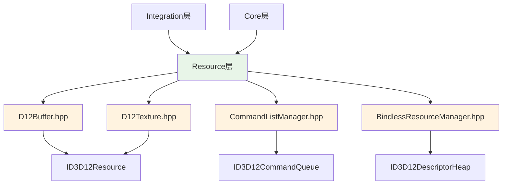

# Resource层 - DirectX 12资源管理架构

## 🎯 层次定位

**DirectX 12资源层**是渲染系统的核心资源管理层，专门负责DirectX 12 API的资源封装、Bindless资源绑定、和现代GPU资源管理。本层为上层提供高效的资源抽象，屏蔽底层DX12复杂性。

## 📁 核心类概览

### 1. D12Buffer.hpp
- **职责**: DirectX 12缓冲区资源专用封装
- **功能**: 顶点缓冲、索引缓冲、常量缓冲区管理
- **特性**: GPU上传堆管理、内存映射优化

### 2. D12Texture.hpp
- **职责**: DirectX 12纹理资源专用封装  
- **功能**: 2D纹理、立方体贴图、G-Buffer RT管理
- **特性**: 多重采样、Mipmap生成、资源状态转换

### 3. CommandListManager.hpp
- **职责**: DirectX 12多命令队列管理器
- **功能**: 图形/计算/复制队列协调、帧同步
- **特性**: 并行命令记录、GPU同步原语

### 4. BindlessResourceManager.hpp
- **职责**: 现代Bindless资源绑定系统
- **功能**: 描述符堆管理、百万级资源支持
- **特性**: 动态资源绑定、GPU驱动渲染支持

## 🏗️ DirectX 12资源架构

### 核心资源基类设计
```cpp
// D12Resource基类 - 所有DX12资源的共同基础
class D12Resource {
protected:
    Microsoft::WRL::ComPtr<ID3D12Resource> m_resource;
    D3D12_RESOURCE_STATES m_currentState;
    std::wstring m_debugName;
    
public:
    virtual ~D12Resource() = default;
    virtual bool Create(ID3D12Device* device) = 0;
    virtual void TransitionTo(ID3D12GraphicsCommandList* cmdList, 
                             D3D12_RESOURCE_STATES newState);
};
```

### Bindless架构设计
```cpp
// BindlessResourceManager - 现代资源绑定
class BindlessResourceManager final {
private:
    // GPU可见描述符堆 (Shader Resource Views)
    Microsoft::WRL::ComPtr<ID3D12DescriptorHeap> m_srvHeap;
    // CPU描述符堆 (Render Target Views)  
    Microsoft::WRL::ComPtr<ID3D12DescriptorHeap> m_rtvHeap;
    
    // 资源槽位管理
    std::bitset<65536> m_allocatedSlots; // 64K资源槽位
    std::unordered_map<uint32_t, std::weak_ptr<D12Texture>> m_textureRegistry;
    
public:
    uint32_t RegisterTexture(std::shared_ptr<D12Texture> texture);
    void UnregisterTexture(uint32_t slotIndex);
    void BindDescriptorHeaps(ID3D12GraphicsCommandList* cmdList);
};
```

## 🔧 资源管理特性

### 1. 智能指针资源管理
```cpp
// 自动内存管理 - 避免资源泄漏
std::unique_ptr<D12Buffer> vertexBuffer;
std::shared_ptr<D12Texture> diffuseTexture; 
std::weak_ptr<D12Texture> shadowMap; // 避免循环引用
```

### 2. GPU资源状态自动转换
```cpp
// 自动状态转换 - 简化资源屏障管理
void D12Texture::CreateAsGBufferRT(ID3D12Device* device, /*...*/) {
    // 自动设置为RENDER_TARGET状态
    m_currentState = D3D12_RESOURCE_STATE_RENDER_TARGET;
}
```

### 3. 现代Bindless支持
- **海量资源**: 支持64K纹理同时绑定
- **GPU驱动**: 减少CPU-GPU同步开销  
- **动态绑定**: 运行时资源注册/注销

## 📊 资源层架构图



## 🎯 SOLID原则实践

### 单一职责原则 (SRP)
- **D12Buffer**: 专注缓冲区管理
- **D12Texture**: 专注纹理管理  
- **CommandListManager**: 专注命令队列
- **BindlessResourceManager**: 专注资源绑定

### 开放封闭原则 (OCP)
```cpp
// 通过继承扩展新资源类型
class D12ComputeBuffer : public D12Buffer {
    bool CreateAsStructuredBuffer(/*...*/);
};
```

### 依赖倒置原则 (DIP)
- 上层依赖抽象接口，不依赖具体DX12实现
- 可替换为Vulkan或其他图形API实现

## 🚀 性能优化特性

### 1. 内存池管理
- 预分配大块GPU内存
- 子分配器减少内存碎片
- 智能垃圾回收策略

### 2. 并行命令记录
```cpp
// 多线程命令列表记录
void CommandListManager::ExecuteParallel(
    std::vector<std::function<void(ID3D12GraphicsCommandList*)>> tasks) {
    // 并行录制多个命令列表
    // GPU队列异步执行
}
```

### 3. GPU同步优化
- Fence-based帧同步
- 多队列并行执行
- CPU-GPU流水线优化

## 📋 开发状态

- ✅ **D12Buffer/D12Texture设计** - Milestone 1完成
- ✅ **Bindless架构设计** - Milestone 1完成
- ✅ **命令队列管理设计** - Milestone 1完成  
- 🔄 **准备实现阶段** - Milestone 2即将开始

## 🔮 未来扩展类预测

基于Iris架构分析，本层未来可能扩展的类：

### 资源管理扩展 (8-12个类)
- **D12RenderTarget** - 专用渲染目标
- **D12DepthStencil** - 深度模板缓冲
- **D12ComputeBuffer** - 计算着色器缓冲
- **D12IndirectBuffer** - GPU驱动渲染缓冲
- **MemoryAllocator** - GPU内存分配器
- **ResourceUploader** - 异步资源上传
- **DescriptorManager** - 描述符分配管理
- **StateTransitionManager** - 资源状态管理

## 🔗 相关文档

- **引擎集成层**: `../Integration/CLAUDE.md`
- **渲染核心层**: `../Core/CLAUDE.md`
- **总体架构**: `../CLAUDE.md`
- **项目设计**: `F:/p4/Personal/SD/Thesis/Design/CLAUDE.md`

## 🎯 教学价值

本层展示了现代图形API的正确使用方式，包括**资源生命周期管理**、**Bindless渲染架构**、**GPU内存管理**等核心概念，是学习现代渲染编程的重要基础。

*最后更新: 2025-09-13*  
*状态: 文件夹重命名，路径更新完成*