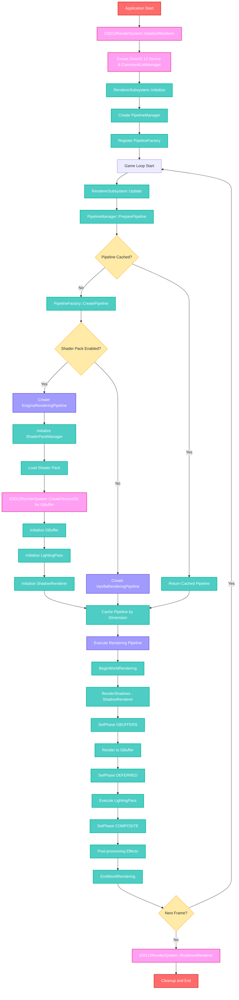

# Enigma引擎架构更新总结 - 基于真实Iris设计

**日期**: 2025-09-15  
**状态**: Milestone 1.8 完成  
**关键成就**: D3D12RenderSystem静态API封装层实现完成  

---

## 🔥 架构重构核心成果

### ✅ 已完成的重大架构调整

1. **移除错误设计**
   - ❌ `EnigmaRenderer.hpp` - 不存在于真实Iris架构中
   - 理由：通过Chrome MCP分析Iris源码，发现此设计为错误推断

2. **新增真实Iris核心组件**
   - ✅ `PipelineManager.hpp` - 基于 `net.irisshaders.iris.pipeline.PipelineManager.java`
   - 实现工厂模式 + 按维度缓存的管线管理

3. **保持核心组件**
   - ✅ `ShaderPackManager.hpp` - 对应真实Iris的着色器包管理
   - ✅ 所有Resource层组件 - DirectX 12专用封装层

4. **Milestone 1.8 新增核心组件** ⭐
   - ✅ `D3D12RenderSystem.hpp` - DirectX 12静态API封装层
   - 对应Iris的IrisRenderSystem全局API抽象
   - 实现设备管理、GPU能力检测、资源创建统一接口
   - 提供线程安全检查和调试支持

---

## 🏗️ 更新后的真实架构UML

```mermaid
classDiagram
    %% DirectX 12静态API层 (新增)
    class D3D12RenderSystem {
        <<static>>
        +InitializeRenderer(bool, bool) void
        +ShutdownRenderer() void
        +GetDevice() ID3D12Device*
        +GetCommandListManager() CommandListManager*
        +GetDXGIFactory() IDXGIFactory6*
        +SupportsDirectStorage() bool
        +SupportsBindlessResources() bool
        +SupportsComputeShaders() bool
        +CreateBuffer(uint64_t) unique_ptr~D12Buffer~
        +CreateTexture2D(uint32_t, uint32_t) unique_ptr~D12Texture~
        +WaitForGPU() void
        +AssertOnRenderThread() void
    }
    
    %% 引擎集成层
    class RendererSubsystem {
        -unique_ptr~PipelineManager~ m_pipelineManager
        +Initialize() bool
        +Update() void
        +GetPipelineManager() PipelineManager*
        +CreatePipelineFactory() PipelineFactory
    }
    
    class PipelineManager {
        -PipelineFactory m_pipelineFactory
        -unordered_map~NamespacedId, unique_ptr~IWorldRenderingPipeline~~ m_pipelinesPerDimension
        -unique_ptr~IWorldRenderingPipeline~ m_currentPipeline
        -int m_versionCounterForSodiumShaderReload
        +PreparePipeline(NamespacedId) IWorldRenderingPipeline*
        +DestroyAllPipelines() void
        +GetPipelineNullable() IWorldRenderingPipeline*
    }
    
    %% 渲染管线接口层
    class IWorldRenderingPipeline {
        <<interface>>
        +BeginWorldRendering() void
        +EndWorldRendering() void
        +SetPhase(WorldRenderingPhase) void
        +RenderShadows() void
        +OnFrameUpdate() void
        +Destroy() void
    }
    
    class IShaderRenderingPipeline {
        <<interface>>
        +GetShaderPackManager() shared_ptr~ShaderPackManager~
        +UseProgram(string) bool
        +HasProgram(string) bool
        +ReloadShaders() bool
        +GetColorTexture(uint32_t) void*
        +FlipBuffers() void
    }
    
    %% 具体实现类
    class VanillaRenderingPipeline {
        +BeginWorldRendering() void
        +SetPhase(WorldRenderingPhase) void
        +RenderShadows() void
    }
    
    class EnigmaRenderingPipeline {
        -shared_ptr~ShaderPackManager~ m_shaderManager
        -shared_ptr~GBuffer~ m_gBuffer
        -shared_ptr~LightingPass~ m_lightingPass
        -shared_ptr~ShadowRenderer~ m_shadowRenderer
        +GetShaderPackManager() shared_ptr~ShaderPackManager~
        +UseProgram(string) bool
        +ExecutePhase(WorldRenderingPhase) void
    }
    
    %% 核心渲染组件
    class ShaderPackManager {
        -unordered_map~string, CompiledShader~ m_shaders
        -ID3D12Device* m_device
        +LoadShaderPack(string) bool
        +CompileShader(string, string, ShaderType) bool
        +GetShader(string) CompiledShader*
        +ParseIrisAnnotations(string) IrisAnnotations
    }
    
    class GBuffer {
        -array~unique_ptr~D12Texture~, 10~ m_colorTextures
        -unique_ptr~D12Texture~ m_depthTexture
        +Initialize(uint32_t, uint32_t) bool
        +GetColorTexture(uint32_t) D12Texture*
        +BeginGBufferPass() void
    }
    
    class LightingPass {
        -shared_ptr~ShaderPackManager~ m_shaderManager
        -shared_ptr~BindlessResourceManager~ m_resourceManager
        +ExecuteDeferredLighting() void
        +RenderLightSources() void
    }
    
    class ShadowRenderer {
        -shared_ptr~ShaderPackManager~ m_shaderManager
        -array~unique_ptr~D12Texture~, 4~ m_cascadeShadowMaps
        +BeginShadowPass() void
        +RenderAllCascades() void
        +GetShadowDepthTexture() D12Texture*
    }
    
    %% DirectX 12资源层
    class CommandListManager {
        -ID3D12CommandQueue* m_graphicsQueue
        -vector~ID3D12CommandList*~ m_commandLists
        +ExecuteCommandLists() void
        +WaitForGPU() void
    }
    
    class BindlessResourceManager {
        -ID3D12DescriptorHeap* m_srvHeap
        -unordered_map~ResourceHandle, uint32_t~ m_resourceSlots
        +RegisterTexture(D12Texture*) ResourceHandle
        +BindDescriptorHeaps() void
    }
    
    class D12Texture {
        -ID3D12Resource* m_resource
        -D3D12_RESOURCE_STATES m_currentState
        +TransitionTo(D3D12_RESOURCE_STATES) void
        +CreateSRV() void
        +CreateRTV() void
    }
    
    class D12Buffer {
        -ID3D12Resource* m_resource
        -void* m_mappedData
        +Map() void*
        +Unmap() void
        +UpdateData(void*, size_t) void
    }
    
    %% 关系定义
    D3D12RenderSystem ||--|| CommandListManager : manages
    D3D12RenderSystem ..> D12Texture : creates
    D3D12RenderSystem ..> D12Buffer : creates
    
    RendererSubsystem ||--|| PipelineManager : manages
    RendererSubsystem ..> D3D12RenderSystem : uses
    PipelineManager ||--o{ IWorldRenderingPipeline : creates/caches
    
    IWorldRenderingPipeline <|-- VanillaRenderingPipeline
    IWorldRenderingPipeline <|-- IShaderRenderingPipeline
    IShaderRenderingPipeline <|-- EnigmaRenderingPipeline
    
    EnigmaRenderingPipeline ||--|| ShaderPackManager : uses
    EnigmaRenderingPipeline ||--|| GBuffer : uses
    EnigmaRenderingPipeline ||--|| LightingPass : uses
    EnigmaRenderingPipeline ||--|| ShadowRenderer : uses
    
    ShadowRenderer ||--|| ShaderPackManager : uses
    LightingPass ||--|| ShaderPackManager : uses
    LightingPass ||--|| BindlessResourceManager : uses
    
    GBuffer ||--o{ D12Texture : manages
    ShadowRenderer ||--o{ D12Texture : manages
    BindlessResourceManager ||--|| D12Texture : binds
    
    %% 样式定义
    classDef staticapi fill:#ff9ff3,stroke:#e84393,stroke-width:3px,color:#fff
    classDef manager fill:#4ecdc4,stroke:#00b894,stroke-width:2px,color:#fff
    classDef interface fill:#e1f5fe,stroke:#0277bd,stroke-width:2px
    classDef concrete fill:#f3e5f5,stroke:#7b1fa2,stroke-width:2px
    classDef resource fill:#fff3e0,stroke:#f57c00,stroke-width:2px
    
    class D3D12RenderSystem staticapi
    class RendererSubsystem,PipelineManager,ShaderPackManager manager
    class IWorldRenderingPipeline,IShaderRenderingPipeline interface
    class VanillaRenderingPipeline,EnigmaRenderingPipeline,GBuffer,LightingPass,ShadowRenderer concrete
    class CommandListManager,BindlessResourceManager,D12Texture,D12Buffer resource
```

---

## 🔄 核心调用流程图



---

## 📊 架构层次重新整理

### 0. **DirectX 12静态API层 (Core/DX12/)** ⭐ Milestone 1.8新增
```cpp
D3D12RenderSystem.hpp               // DirectX 12全局API封装 ✅ (新增)
```

### 1. **引擎集成层 (Integration/)**
```cpp
RendererSubsystem.hpp              // EngineSubsystem集成 ✅
PipelineManager.hpp                // 真实Iris核心管理器 ✅ (新增)
IWorldRenderingPipeline.hpp        // 基础管线接口 ✅
IShaderRenderingPipeline.hpp       // 着色器扩展接口 ✅
```

### 2. **渲染管线核心 (Core/)**
```cpp
Pipeline/
├── VanillaRenderingPipeline.hpp   // 原版渲染实现 ✅
└── EnigmaRenderingPipeline.hpp     // 着色器渲染实现 ✅

Renderer/
├── ShadowRenderer.hpp              // 阴影渲染专门处理 ✅
├── CompositeRenderer.hpp           // 后处理渲染 ✅
├── GBuffer.hpp                     // G-Buffer管理 ✅
└── LightingPass.hpp                // 延迟光照 ✅
```

### 3. **着色器系统**
```cpp
ShaderPackManager.hpp               // Iris着色器包管理 ✅ (已修复项目引用)
```

### 4. **DirectX 12资源层 (Resource/)**
```cpp
Buffer/D12Buffer.hpp                // 缓冲区资源封装 ✅
Texture/D12Texture.hpp              // 纹理资源封装 ✅
CommandListManager.hpp              // 命令队列管理 ✅
BindlessResourceManager.hpp         // 现代资源绑定 ✅
```

---

## 🎯 关键架构决策对比

| 设计决策 | 错误推断架构 | 真实Iris架构 | 当前状态 |
|---------|-------------|-------------|----------|
| 管线管理 | EnigmaRenderer单一管理 | PipelineManager工厂模式 | ✅ 已修正 |
| 管线创建 | 直接实例化 | Factory + Cache策略 | ✅ 已实现 |
| 维度支持 | 单一全局管线 | 按维度分离缓存 | ✅ 已实现 |
| Sodium兼容 | 未考虑 | 版本计数器同步 | ✅ 已实现 |
| 接口分离 | 单一接口 | 分层接口设计 | ✅ 已实现 |
| **DirectX 12 API管理** | **分散在各组件** | **IrisRenderSystem静态层** | **✅ D3D12RenderSystem已实现** |
| **全局设备访问** | **通过RendererSubsystem** | **静态全局访问** | **✅ 已实现** |
| **GPU能力检测** | **运行时检测** | **初始化时缓存** | **✅ 已实现** |

---

## 🏆 教学价值总结

### 软件工程实践
1. **源码驱动设计** - 避免基于假设的架构设计
2. **工厂模式应用** - 解耦对象创建和管理逻辑  
3. **接口分离原则** - IWorldRenderingPipeline vs IShaderRenderingPipeline
4. **缓存策略设计** - 性能优化的系统性考虑
5. **静态API封装** - D3D12RenderSystem对应Iris的IrisRenderSystem模式 ⭐

### 架构设计模式
1. **管线管理模式** - PipelineManager的职责分离
2. **命名空间模式** - NamespacedId的类型安全管理
3. **观察者模式** - FrameUpdateListener的事件通知
4. **资源管理模式** - RAII在图形资源中的应用
5. **静态工具类模式** - D3D12RenderSystem全局API抽象 ⭐

### DirectX 12特性学习
1. **显式命令队列管理** - CommandListManager职责分离
2. **GPU能力检测缓存** - 初始化时检测，运行时查询
3. **Bindless资源架构** - 现代图形API的资源绑定
4. **线程安全设计** - 静态访问的线程检查机制 ⭐

---

## 📈 当前项目状态

### ✅ Milestone 1.8 完成项目
- **D3D12RenderSystem实现完成** - DirectX 12静态API封装层 ⭐
- **GPU能力检测系统** - 支持DirectStorage、Bindless、光线追踪等
- **设备和命令队列管理** - 全局静态访问模式
- **线程安全检查机制** - 渲染线程断言和验证
- **调试和验证层支持** - 开发期间的错误检测
- **资源创建统一接口** - CreateBuffer、CreateTexture2D等

### ✅ 历史完成项目 (Milestone 1.5)
- **架构纠错完成** - 基于真实Iris源码重构
- **所有头文件设计完成** - 10个核心类完整定义 (新增D3D12RenderSystem)
- **项目文件同步完成** - Engine.vcxproj正确引用
- **命名空间统一完成** - 全面使用enigma::graphic
- **UML图表更新完成** - 反映真实架构关系

### 🚀 准备进入Milestone 2
- **基础实现阶段** - 开始编写.cpp实现文件
- **核心组件优先** - D3D12RenderSystem、PipelineManager、ShaderPackManager先行
- **DirectX 12集成** - D12Buffer、D12Texture基础功能
- **单元测试准备** - 验证核心逻辑正确性

---

**结论**: 基于真实Iris源码的架构重构已完成，D3D12RenderSystem静态API封装层在Milestone 1.8中成功实现。为后续实现阶段提供了坚实的设计基础，包括DirectX 12设备管理、GPU能力检测和资源创建的统一接口。所有关键组件都有明确的职责分离和清晰的依赖关系，符合现代软件工程最佳实践。

---
*基于真实Iris源码分析 | Chrome MCP验证*  
*Milestone 1.8 完成 | 2025-09-15*